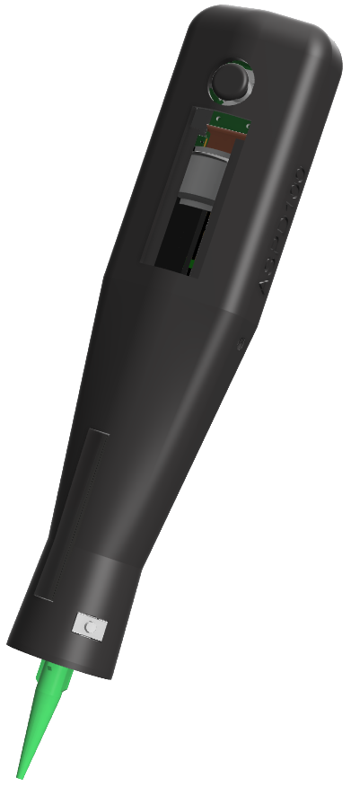

<!-- PROJECT SHIELDS -->
[![Contributors][contributors-shield]][contributors-url]
[![Forks][forks-shield]][forks-url]
[![Stargazers][stars-shield]][stars-url]
[![Issues][issues-shield]][issues-url]
[![MIT License][license-shield]][license-url]

<!-- PROJECT LOGO -->
 

  

  <h3 align="center">Automatic Solder Paste Dispenser ASPD100</h3>

  

    An awesome tool for your workshop!
     
    <a href="https://aspd100.makanddream.fr/docs"><strong>Explore the docs »</strong></a>
     
     
    <a href="https://www.youtube.com/watch?v=vp8d3J2XtJ8">View Demo</a>
    ·
    <a href="https://github.com/makanddream/automatic-solder-paste-dispenser/issues">Report Bug</a>
    ·
    <a href="https://github.com/makanddream/automatic-solder-paste-dispenser/issues">Request Feature</a>
  

## What is ASPD100?

It is a tool that allows to apply precisely and in controlled quantity any products such as: solder paste, flux, glue, ...

| 3D Case Design | 3D PCB Design | First proto | Second proto |
| :--------: | :--------: | :--------: | :--------: |
|  |  |  | 

## Documentation
* [Full documentation](https://aspd100.makanddream.fr/docs) - Includes in-depth guides on everything ASPD100 software

## License
The code created by the community is GNU GPLv3. Unless noted elsewhere. Other components such as HAL/FreeRTOS have their own licence.

<!-- MARKDOWN LINKS & IMAGES -->
<!-- https://www.markdownguide.org/basic-syntax/#reference-style-links -->
[contributors-shield]: https://img.shields.io/github/contributors/makanddream/automatic-solder-paste-dispenser.svg?style=for-the-badge
[contributors-url]: https://github.com/makanddream/automatic-solder-paste-dispenser/graphs/contributors
[forks-shield]: https://img.shields.io/github/forks/makanddream/automatic-solder-paste-dispenser.svg?style=for-the-badge
[forks-url]: https://github.com/makanddream/automatic-solder-paste-dispenser/network/members
[stars-shield]: https://img.shields.io/github/stars/makanddream/automatic-solder-paste-dispenser.svg?style=for-the-badge
[stars-url]: https://github.com/othneildrew/Best-README-Template/stargazers
[issues-shield]: https://img.shields.io/github/issues/makanddream/automatic-solder-paste-dispenser.svg?style=for-the-badge
[issues-url]: https://github.com/makanddream/automatic-solder-paste-dispenser/issues
[license-shield]: https://img.shields.io/github/license/makanddream/automatic-solder-paste-dispenser.svg?style=for-the-badge
[license-url]: https://github.com/makanddream/automatic-solder-paste-dispenser/blob/master/LICENSE.txt
[linkedin-shield]: https://img.shields.io/badge/-LinkedIn-black.svg?style=for-the-badge&logo=linkedin&colorB=555
[linkedin-url]: https://linkedin.com/in/alan-le-fol
